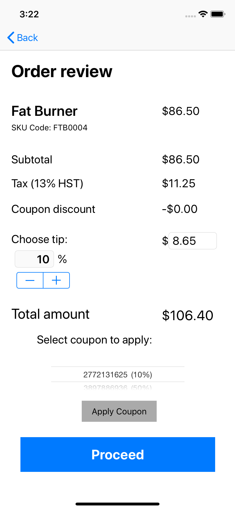
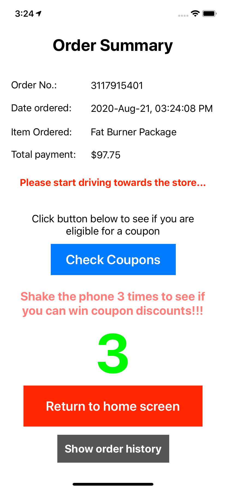
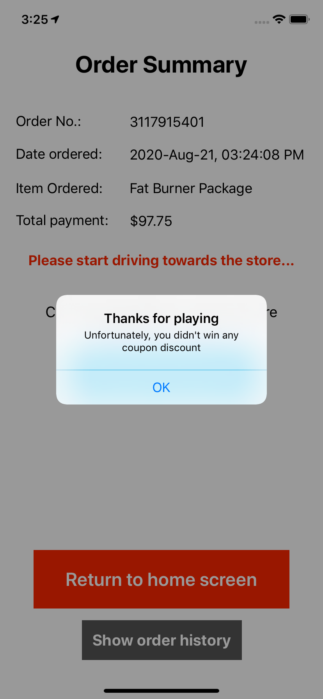
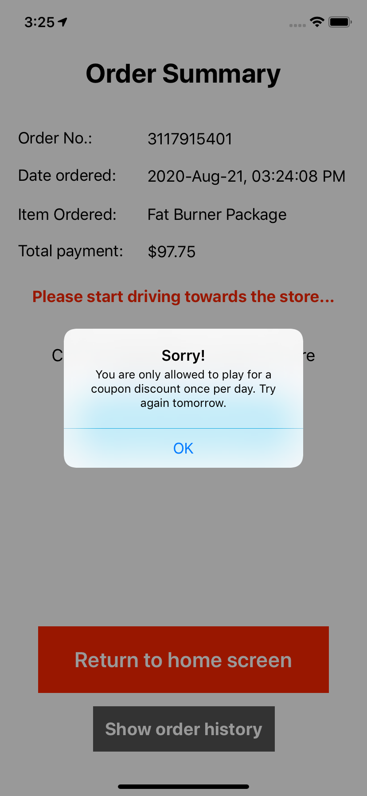

# Live Fit Food Ordering App for iOS

### Mock ordering app for the livefitfood.ca website.
#### ***DISCLAIMER: This app was developed as an exercise in native iOS mobile application development and is not in any way affiliated with the livefitfood.ca website or any of its mobile apps.*** 

#### Screenshots  

                                                  

#### Technologies/Concepts used

* Persistent data storage using the Apple's Core Data framework 

* Navigation Controller and Segues

* Table View Controllers and custom table view cells

* Core Data entity relationships

* Data passing between segues

* SwiftyJSON library for JSON parsing operations

* Database migration from JSON file to sqlite

* UIImagePickerController for camera and photo library pictures

* UIAlertController for popup alerts

#### Features

* Unified sign-in and sign-up features.

* Email used during sign-up is checked for validity

#### Link to specification: <a href="./docs/MAD4006 - Project - Meal Delivery Apps, Revised.pdf" target="_blank">[App Specification]</a>
