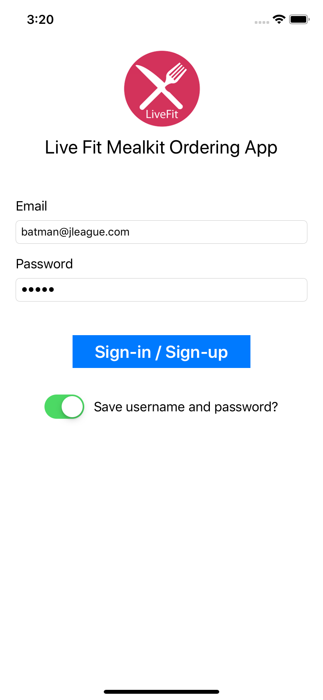
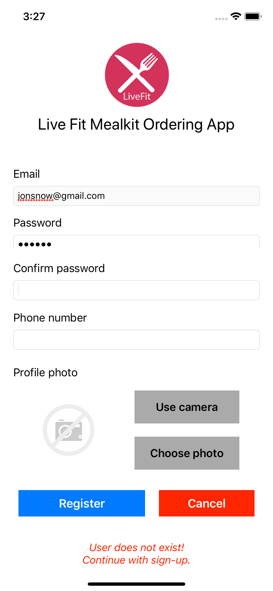
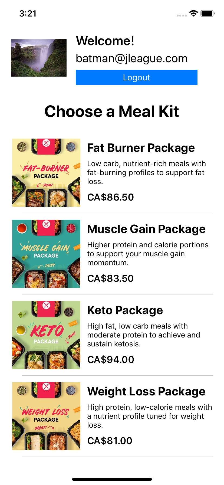
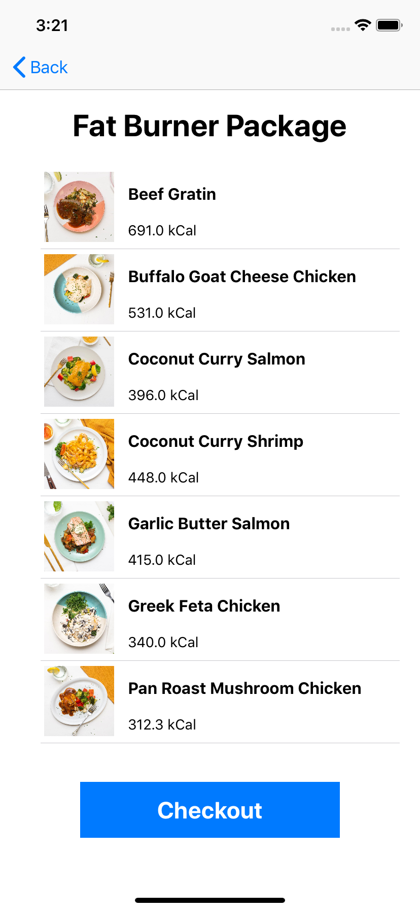
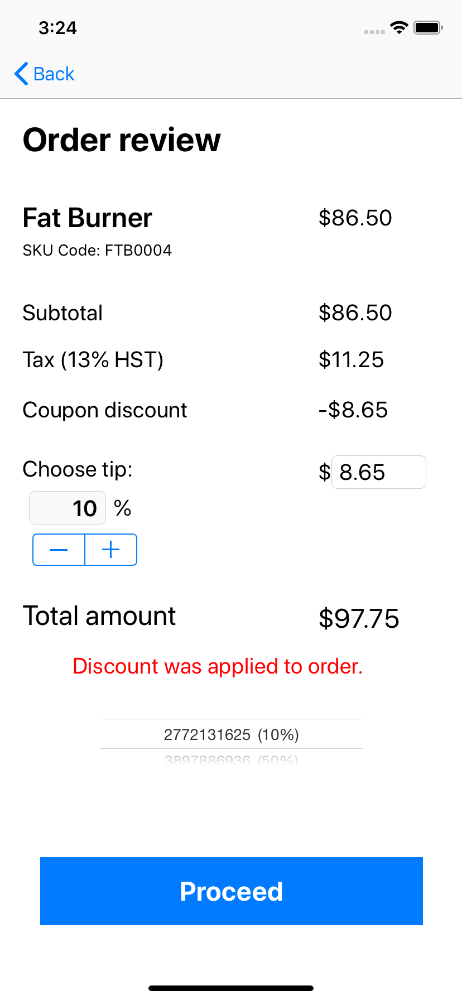
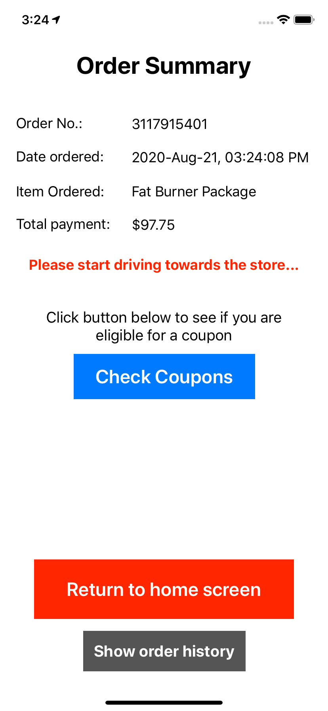
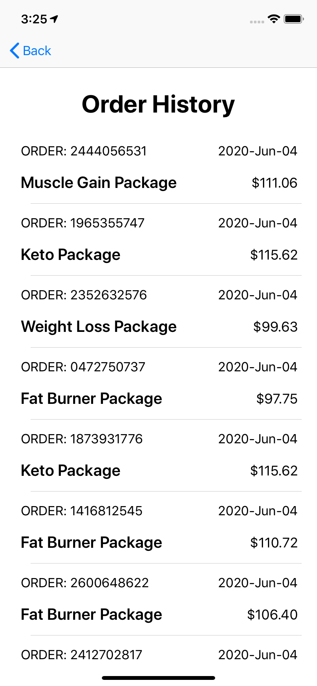

# Live Fit Food Ordering App for iOS

### Mock ordering app for the livefitfood.ca website.
#### ***DISCLAIMER: This app was developed as an exercise in native iOS mobile application development and is not in any way affiliated with the livefitfood.ca website or any of its mobile apps.*** 

#### Screenshots  

                              

#### Technologies/Concepts used

* Persistent data storage using the Apple's Core Data framework 

* Auto-Layout

* Navigation Controller and Segues

* Core Location 

* Table View Controllers and custom table view cells

* Core Data entity relationships

* Data passing between segues

* SwiftyJSON library for JSON parsing operations

* Database migration from JSON file to sqlite

* UIImagePickerController for camera and photo library pictures

* UIAlertController for popup alerts

* Shake gesture detection

#### Features

* Unified sign-in and sign-up features.

* Email validity check during sign-up.

* Mealkit list display with name, description and price

* Detailed view of mealkit when clicked showing meals that are available for the package.

* Tip selection option during checkout.

* Order history display.

* Optional coupon application for additional discount to meals that were purchased.

* User location tracking to determine whether user is within business location vicinity.

* Daily mini-game that allows the customer to win a coupon.

#### Link to specification: <a href="./docs/MAD4005 - Project - Meal Delivery Apps.pdf" target="_blank">[App Specification]</a>
